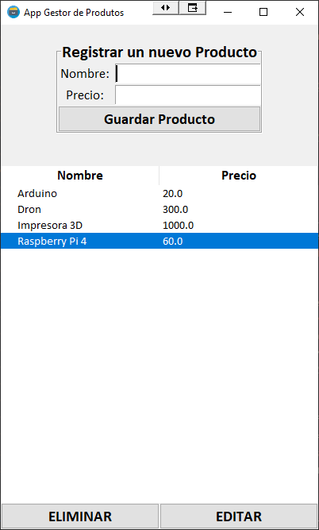
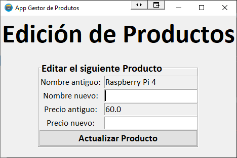

# Tokio: Modulo 6
Practicando se aprende

## Práctica 2
App de escritorio con Tkinter y base de datos SQLite3.

### Descripción
En esta práctica se va a crear una app de escritorio con conexión a una base de datos.
Esta aplicación tendrá como objetivo ser un gestor de productos, es decir,
una aplicación que permitirá al usuario realizar las siguintes acciones
- Crear um producto (nombre y precio)
- Editar un producto
- Eliminar un producto

### Pantallas de Ejemplo
- Registar un nuevo producto

- Edición de Productos

### Tecnologías a utilizar
- Python

- PyCharm

- Tkinter library

- SQLite

### Mejoras y Entrega
Mejoras que se pueden realizar a la práctica
- [X] Cambiar y mejorar la interfaz gráfica
- [X] Añadir un campo Categoría para el producto
- [X] Añadir um campo de Stock para el producto

Entrega de la práctica:
- **Realizar un documento de texto con capturas de pantalla donde se vea el funcionamiento completo de la app (y de la base de dados)**
- Comprimir en un fichero la carpeta completa del proyecto de PyCharm y el documento de texto y llamarlo: **M6_02_nombre_apellido1_apellido2.zip** (cambiando nombre y apellidos por los tuyos)
